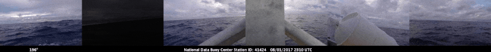

# Buoy Cam Scraper

A scraper to pull images from NBDC's network of buoys that have cam feeds ([link](http://www.ndbc.noaa.gov/buoycams.shtml)), lonely sensors that constantly monitor our seas, air and atmosphere. The cameras are updated on an hourly basis, so the script is set to scrape the feeds every hour from the time it starts running.




## Installation

Make sure you have [node](https://nodejs.org/en/) installed. Download the files, open a terminal in the buoy-cam-scraper folder and run:

```
npm install
```

## Usage

Open up a terminal in buoy-cam-scraper/ and run:

```
npm run scrape-cams
```

This will start reading and capturing new images from the buoy cameras and saving them to scraped-images. The script will re-scrape every 1 hour. Each file is named in the following format:

```
[UTC ms when photo was taken by buoy]-[UTC ms when photo was downloaded]-[ID of buoy].jpg
```

The UTC time when the photo was taken by the buoy is parsed via OCR using tesseract.js. Images that have no data (i.e. all white images) and images that have already been downloaded will be skipped.

## Performance

The code is written to be run on a Raspberry Pi. On my Raspberry Pi 2B, it takes about ~30 minutes to scrape images from all the buoy cams. The bulk of the time is spent on OCR. On a modern laptop, it takes <1 minute.

## Data

The data folder contains some scraped meta information:

- buoycam-id-list.json - a list of buoy IDs that have cameras, hand collected on 8/1/17
- buoycam-info.json - meta information about the buoy cams including: name, lat-long location and a base 64 image of the buoy. Scraped on 8/1/17 using `npm run gather-station-info`.

## To Do

- Improve performance
- Extra error handling
- Post visualizations